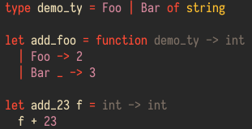

## virtual-types.nvim
This plugin shows type annotations for functions in virtual text using built-in LSP client.

I use it with [ocaml-lsp](https://github.com/ocaml/ocaml-lsp), but it will probably work with other LSP servers that support [textDocument/codeLens](https://microsoft.github.io/language-server-protocol/specification#textDocument_codeLens) request.

## Screenshot


## Prerequisites
* Neovim 0.5+
* [nvim-lsp](https://github.com/neovim/nvim-lsp) plugin
* [ocaml-lsp](https://github.com/ocaml/ocaml-lsp) language server

## Installation

Install with plugin manager:

```
Plug 'jubnzv/virtual-types.nvim'
```

And add the following line in your LSP configuration:
```
lua require'nvim_lsp'.ocamllsp.setup{on_attach=require'virtualtypes'.on_attach}
```

